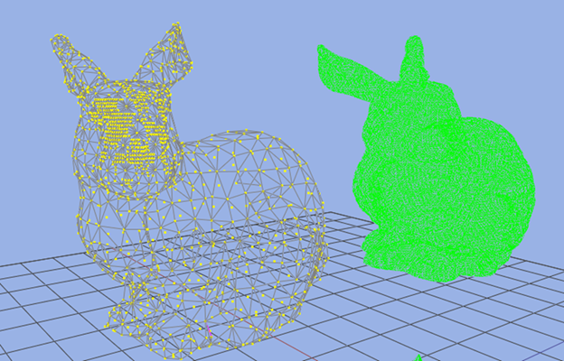

# OPTIMIZING BOUNDING VOLUME HIERARCHY GENERATION BY GEOMETRY SIMPLIFICATION WITH CUDA
**This was my unfinished thesis project but I converted to an informal personal project!**

In computer games, processing massive number of objects with high-precision collision detection is a challenging task. A well-known approach being used to tackle this important task is using two phases; a broad phase which includes bounding volume hierarchy(BVH) generation for preventing brute force collision testing among all the objects against each other and narrow phase for more precise collision detection among the objects filtered by broad phase. Also, a relatively new approach used is to use Graphical Processing Units(GPU) instead of Central Processing Units (CPU). 
In this thesis, a geometric simplification method is and improved by using Level Of Detail (LOD) optimization on remesh calculation and other  parallel algorithm for broad phase collision is used for generating BVH structure. 

## Results
 

## References 
1 [Maximizing Parallelism in the Construction of BVHs, Octrees, and k-d Trees  , Tero Karras](./docs/Maximizing_Parallelism_in_the_Construction_of_BVHs_Octrees_and_kd_Trees.pdf) 